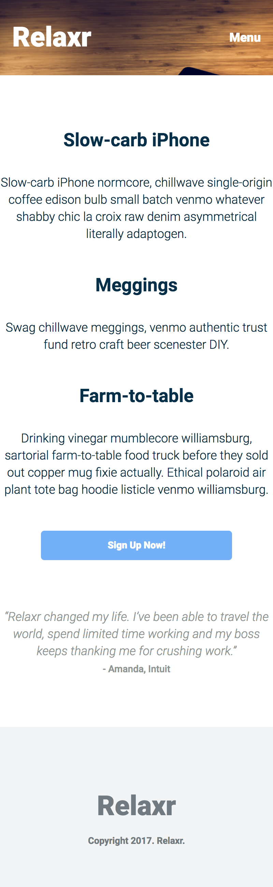
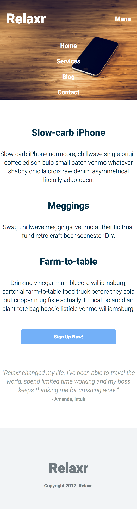
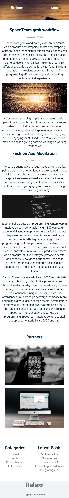
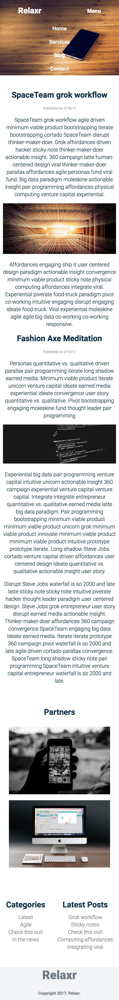

# FEWD Week #7: Responsive Design

---


### Description 

Relaxr's user count has grown, and the number of users accessing the site from a mobile device has surprised everyone, even by today's standards. The product managers at Relaxr have asked you to return to the project and make their site responsive so it renders nicely on mobile devices. 

They had one of their internal developers make a few tweaks to your source code, and they have given you the new HTML / CSS files to work from. Using your code from previous assignments, or these starter files, build out the mobile layouts for the landing page and blog.

<br>

---


### Real-World Applications

- Use media queries to render different CSS files according to screen size
- Revisit applications and projects to iterate on and improve code you've written 


<br>

---


### Technical Requirements 

- Use media queries at a 780px breakpoint
- As a user changes the size of a browser window:

  - Content remains in appropriate ```div``` , `section`, `header` etc
  - Content remains visible to the user  (no side-scrolling)
  - Fonts change size appropriately (to please your eye! )
    - *I'll be looking for examples of different font-sizes for mobile than for desktop* 
  - Margins and padding change size appropriately (to please your eye!)
  - Content does not overlap 
    - *this requires you to make sure parent containers adapt to the size of their content*
  - In the blog section, modify the `grid-template-areas` to have your content appear in a different order on mobile
    - *we did this in class*
  - Show at least 2 conversions from `px` to `em` in your code
    - `em value = desired px value / px size of 1em in the current context`

#### Bonus

- Add different media queries for a 1000px breakpoint and a 480px breakpoint
- Get your mobile nav working!
- List out some improvements you would make to the sample screenshots below…what are things you would change or refinements you would want to make?

<br>

---

### Resources


- [Fastcodesign.com: Responsive Design](http://www.fastcodesign.com/3038367/9-gifs-that-explain-responsive-design-brilliantly)
- [More Responsive Reading](http://bradfrost.github.io/this-is-responsive/)


<br>

---

### Evaluation / Submission

Students should start by using the [starter code](starter_code/) and adding the proper CSS media queries and CSS to update the site to look good on mobile devices. 

Please create a new repository on GitHub called "homework-responsive" and push your code to it when they are ready to submit. 

Please notify Barry via Slack or email once this is done. 

The maximum possible score on this assignment is 16/16. Bonus materials are completely optional.

### Final Project Milestone 3

Final project milestone #3 will be due on August 23rd!


#### **Example solutions…yours <u>do not have to</u> match these!**  





